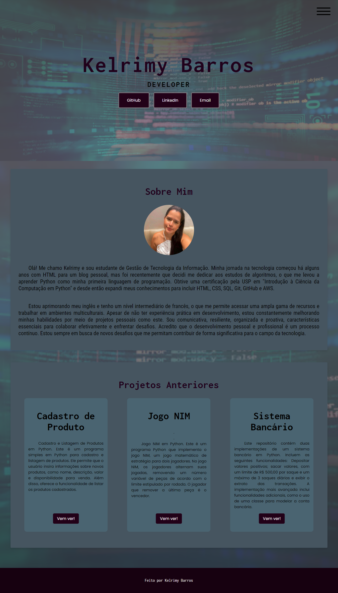

# Primeiro Portfolio

Bem-vindo ao meu portfólio! Este projeto foi desenvolvido para apresentar minhas habilidades e alguns dos meus projetos anteriores.

## Tecnologias Usadas

- **HTML:** Estrutura da página.
- **CSS:** Estilos e layout da página.
- **Fontes Google:** Tipografia personalizada.
- **Imagens:** Visuais do portfólio.

## Recursos Interessantes

- **Design Responsivo**: O portfólio é totalmente responsivo e adaptável a diferentes tamanhos de tela.
- **Menu Hamburguer**: Um menu interativo que melhora a navegação em dispositivos móveis.
- **Estilos Personalizados**: Utilização de fontes personalizadas do Google Fonts para um visual atraente.
- **Seções Informativas**: Inclui seções como "Sobre Mim" e "Projetos Anteriores" para destacar minhas habilidades e experiências.
- **Links para Redes Sociais:** Acesso direto ao meu GitHub, LinkedIn e email.

## Visualização

Você pode visualizar o portfólio completo através deste [link](https://kelrimy.github.io/Primeiro-Portfolio/).



## Estrutura do Projeto

O projeto está organizado da seguinte maneira:

```
Primeiro-Portfolio/
├── index.html
├── style.css
├── script.js
├── foto.png
├── previa.png
└── README.md
```

## Contato

Você pode me encontrar nas seguintes plataformas:

- [GitHub](https://github.com/Kelrimy)
- [LinkedIn](https://linkedin.com/in/kelrimy)
- [Email](mailto:kelrimymbb@gmail.com)

---

Feito com ♥ por Kelrimy Barros


